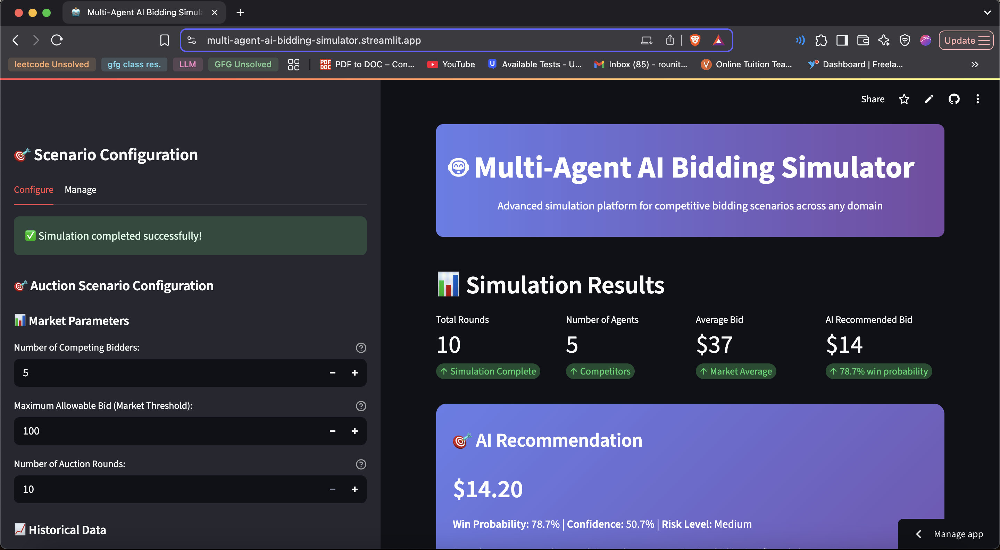
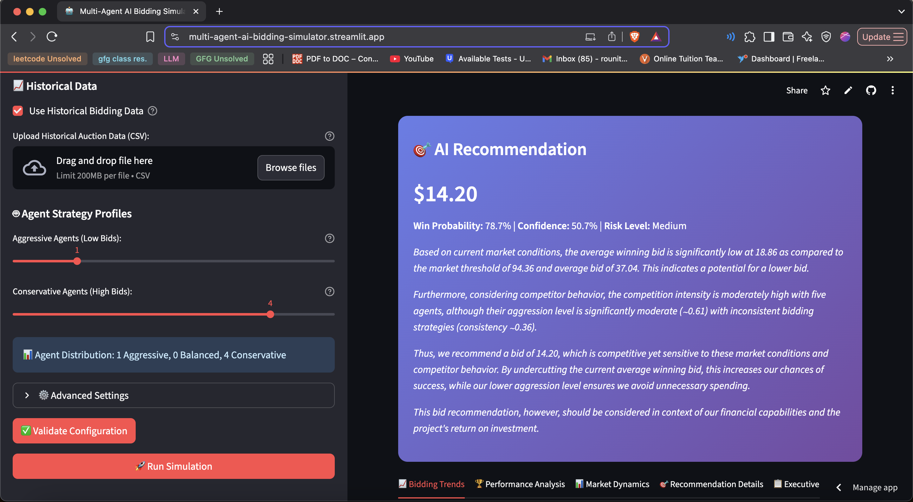
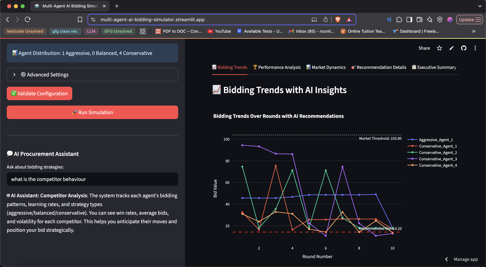
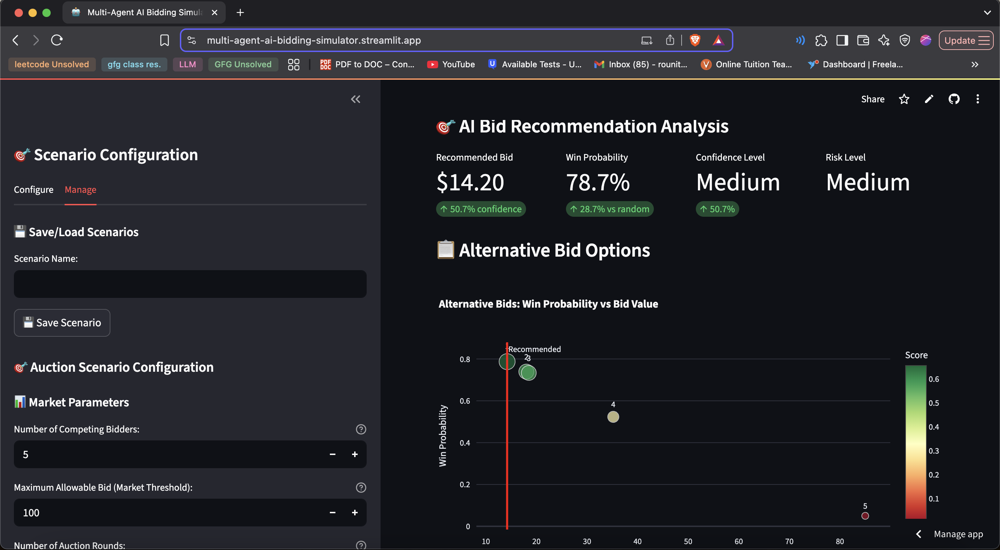

# Multi-Agent AI Bidding Simulator

## Project Overview

The Multi-Agent AI Bidding System is a sophisticated simulation framework that combines Deep Q-Network (DQN) reinforcement learning with multi-agent competitive bidding strategies and advanced AI assistance. This system demonstrates cutting-edge AI-powered decision-making in competitive market environments, featuring real-time data visualization, intelligent bid optimization, comprehensive performance analytics, and an intelligent AI Assistant.

The platform serves as both a research tool for studying multi-agent systems and a practical demonstration of how artificial intelligence can be applied to competitive bidding scenarios. It integrates multiple AI technologies including reinforcement learning, natural language processing, predictive analytics, and hybrid AI-RL decision-making to create a comprehensive bidding ecosystem.

## 🚀 **Latest Features (v2.0)**

### **🤖 Enhanced AI Assistant**
- **Intelligent Chat Interface**: Context-aware AI assistant with conversation history
- **Quick Action Buttons**: Instant answers to common questions (Strategy, Recommendations, Analysis, Setup)
- **Proactive Insights**: Automatic suggestions based on simulation state
- **Collapsible Chat History**: Clean, space-efficient conversation management
- **Loading Indicators**: Real-time feedback during AI processing

### **🧠 Hybrid AI-RL System**
- **AI Strategy Integration**: GPT-4 powered strategic suggestions for agents
- **Confidence-Based Decision Making**: Dynamic weighting of AI vs RL decisions
- **Market Adaptation**: Real-time strategy adjustment based on market conditions
- **Performance Tracking**: Comprehensive metrics for hybrid system effectiveness

### **⚙️ Advanced Configuration**
- **AI Strategy Weight Control**: User-adjustable AI influence (0.0-1.0)
- **Dynamic Weight Adjustment**: Automatic adaptation based on market volatility
- **Strategy Profiles**: Aggressive, Balanced, Conservative with profile-specific exploration
- **Real-time Market Analysis**: Volatility assessment and positioning analysis

## 📸 App Screenshots

Here is a glimpse of the enhanced Multi-Agent AI Bidding System in action:

<table style="width:100%; border-collapse: collapse;">
  <tr>
    <td style="width:50%; padding: 10px; text-align: center; vertical-align: top;">
      
      <br><br>
      <strong>Scenario Configuration & Bidding Trends</strong><br>
      <em>Configure market parameters and view real-time bidding patterns with AI insights</em>
    </td>
    <td style="width:50%; padding: 10px; text-align: center; vertical-align: top;">
      
      <br><br>
      <strong>AI Bid Recommendation Analysis</strong><br>
      <em>Get intelligent bid recommendations with win probability and risk assessment</em>
    </td>
  </tr>
  <tr>
    <td style="width:50%; padding: 10px; text-align: center; vertical-align: top;">
      
      <br><br>
      <strong>Historical Data Integration</strong><br>
      <em>Upload and analyze historical bidding data for enhanced predictions</em>
    </td>
    <td style="width:50%; padding: 10px; text-align: center; vertical-align: top;">
      
      <br><br>
      <strong>Executive Summary & Strategic Insights</strong><br>
      <em>Comprehensive analysis with AI-generated strategic recommendations</em>
    </td>
  </tr>
</table>

## Problem Statement

Traditional bidding systems often rely on static strategies or simple rule-based approaches that fail to adapt to dynamic market conditions. These systems typically suffer from:

- Inability to learn from historical bidding patterns
- Lack of real-time market adaptation
- Limited strategic depth in competitive scenarios
- Absence of intelligent adaptation to competitor behavior
- Poor performance analytics and insights
- No intelligent assistance for users

The challenge lies in creating an intelligent system that can dynamically adjust bidding strategies based on market conditions, competitor behavior, and historical performance while providing intelligent guidance to users.

## Solution Architecture

Our solution implements a multi-layered architecture that addresses these challenges through:

### Core AI Components

**Hybrid AI-RL Agents**: Each bidding agent combines Deep Q-Network reinforcement learning with GPT-4 strategic insights for optimal decision-making. The hybrid approach provides both statistical optimization and strategic reasoning.

**Enhanced AI Assistant**: Intelligent chat interface that provides context-aware guidance, proactive insights, and real-time assistance based on simulation state and user queries.

**OpenAI GPT-4 Integration**: Advanced natural language processing capabilities provide strategic bidding advice, market analysis, and intelligent recommendations. The system leverages GPT-4's reasoning capabilities to generate contextual responses.

**Dynamic Market Threshold System**: An intelligent market mechanism that adjusts bidding thresholds based on historical patterns, statistical analysis, and AI-powered predictions to maintain market stability and fairness.

### Technical Implementation

The system utilizes PyTorch for deep learning implementation, ensuring efficient neural network training and inference. The reinforcement learning component implements experience replay, target networks, and discretized action spaces for stable learning. Market dynamics are modeled using statistical analysis combined with AI-powered predictions to create realistic and challenging bidding environments.

## System Architecture

### Agent Layer
The agent layer consists of AI-powered bidding entities implementing advanced strategies:

- **EnhancedBiddingAgent**: Advanced agent class implementing hybrid AI-RL with opponent-aware adaptation
- **Strategy Profiles**: Aggressive, balanced, and conservative agent behaviors with profile-specific exploration bias
- **Discretized Action Space**: 31 bid options from cost price to market threshold for stable learning
- **Confidence-Based Decision Making**: Dynamic weighting of AI suggestions vs RL optimization
- **Market Adaptation**: Real-time strategy adjustment based on volatility and competition

### Simulation Engine
The core simulation engine orchestrates the bidding process:

- **EnhancedBiddingSimulation**: Advanced simulation controller managing rounds, agent interactions, and market dynamics
- **Market Threshold Management**: Dynamic adjustment of market conditions based on bidding patterns
- **Reward System**: Sophisticated reward mechanism with profit-based bonuses and distance penalties
- **Opponent-Aware Learning**: Agents track competitor behavior and adapt strategies accordingly
- **Performance Analytics**: Comprehensive tracking of hybrid AI-RL effectiveness

### AI Assistant System
Intelligent user assistance and guidance:

- **Context-Aware Responses**: Understands simulation state and provides relevant advice
- **Proactive Insights**: Automatic suggestions based on performance patterns
- **Quick Actions**: Instant answers to common questions
- **Collapsible History**: Clean conversation management
- **Loading Indicators**: Real-time feedback during processing

### Data Management
Comprehensive data handling and persistence:

- **Real-time Data Logging**: Continuous capture of bidding events, agent decisions, and market changes
- **Historical Analysis**: Long-term pattern recognition and trend analysis
- **Performance Metrics**: Detailed tracking of agent success rates, learning curves, and strategy evolution
- **Scenario Management**: Save/load functionality for different bidding scenarios
- **Hybrid Performance Tracking**: AI vs RL decision effectiveness analysis

### Visualization Platform
Advanced dashboard for real-time monitoring and analysis:

- **Enhanced Streamlit Frontend**: Interactive web interface with scenario configuration
- **Multi-dimensional Visualizations**: Comprehensive charts, heatmaps, and trend analyses
- **AI-powered Insights**: Automated analysis and recommendations based on current data
- **Executive Summaries**: Professional reports with strategic insights

## File and Folder Structure

```
multi_agent_ai_simulator/
├── src/                          # Core system implementation
│   ├── agents/                   # AI agent implementations
│   │   └── enhanced_bidding_agent.py # Advanced agents with opponent-aware learning
│   ├── core/                    # Core simulation logic
│   │   ├── enhanced_bidding_simulation.py # Advanced simulation with learning
│   │   └── recommendation_engine.py # AI-powered bid recommendations
│   ├── market/                  # Market dynamics
│   │   └── market_threshold.py  # Dynamic threshold management
│   └── utils/                   # Utility functions
│       ├── config.py           # System configuration
│       ├── data_handler.py     # Data management utilities
│       ├── data/               # Data storage
│       │   └── bid_history.csv # Historical bidding data
│       └── logger.py           # Logging infrastructure
├── frontend/                    # Web interface
│   ├── enhanced_app.py         # Advanced application with scenario configuration
│   └── components/             # UI components
│       ├── sidebar.py          # Navigation and controls
│       ├── enhanced_visualization.py # Advanced visualizations
│       └── scenario_config.py  # Scenario configuration interface
├── data/                       # Data storage
│   └── bid_history.csv        # Historical bidding data
├── logs/                       # System logs
│   └── bidding_system.log     # Application logs
├── multi_agent_ai_simulator.py # Basic application entry point
├── test_enhanced_system.py    # Enhanced system testing
├── test_openai.py             # OpenAI API testing
├── requirements.txt            # Python dependencies
└── README.md                   # Project documentation
```

## Integration Capabilities

### OpenAI API Integration
The system seamlessly integrates with OpenAI's GPT-4 API to provide:

- **Strategic Bidding Advice**: Real-time recommendations based on market analysis
- **Market Trend Analysis**: Natural language insights into bidding patterns
- **AI Assistant Responses**: Context-aware, intelligent user guidance
- **Hybrid AI-RL Decision Making**: GPT-4 strategic suggestions for agent bidding
- **Performance Commentary**: Automated analysis of agent performance and suggestions

### AI Assistant Integration
Intelligent user assistance and guidance:

- **Context-Aware Responses**: Understands simulation state and provides relevant advice
- **Proactive Insights**: Automatic suggestions based on performance patterns
- **Quick Action Buttons**: Instant answers to common questions
- **Collapsible Chat History**: Clean conversation management
- **Loading Indicators**: Real-time feedback during processing

### Data Pipeline Integration
Robust data handling capabilities include:

- **CSV Export/Import**: Standard data format support for external analysis
- **Real-time Streaming**: Live data feeds for external monitoring systems
- **API Endpoints**: RESTful interfaces for system integration
- **Database Connectivity**: Support for various database backends
- **Hybrid Performance Tracking**: AI vs RL decision effectiveness analysis

### Visualization Integration
Comprehensive visualization ecosystem:

- **Plotly Integration**: Interactive charts and graphs
- **Matplotlib Support**: Statistical visualizations and analysis
- **Seaborn Integration**: Advanced statistical plotting
- **Custom Dashboards**: Configurable monitoring interfaces
- **Real-time Analytics**: Live performance metrics and insights

## Installation and Setup

### Prerequisites
- Python 3.9 or higher
- OpenAI API key (optional but recommended for full functionality)
- Git for version control
- Virtual environment support

### Environment Setup

1. **Clone the Repository**
   ```bash
   git clone https://github.com/RounitR/Multi-Agent-AI-Bidding-Simulator.git
   cd multi_agent_ai_simulator
   ```

2. **Create Virtual Environment**
   ```bash
   python3 -m venv venv_py39
   source venv_py39/bin/activate  # On Windows: venv_py39\Scripts\activate
   ```

3. **Install Dependencies**
   ```bash
   pip install -r requirements.txt
   ```

4. **Environment Configuration**
   Create a `.env` file in the project root:
   ```
   OPENAI_API_KEY=your_openai_api_key_here
   ```

### System Verification

1. **Test OpenAI Connection**
   ```bash
   python test_openai.py
   ```

2. **Run Enhanced System Tests**
   ```bash
   python test_enhanced_system.py
   ```

## How to Run

### Enhanced Platform (Recommended)

1. **Launch the Enhanced Dashboard**
   ```bash
   streamlit run frontend/enhanced_app.py
   ```

2. **Access the Interface**
   Open your browser to `http://localhost:8501`

3. **Use the AI Assistant**
   - **Quick Actions**: Click any of the 4 buttons for instant answers
   - **Chat Interface**: Type questions and get context-aware responses
   - **Proactive Insights**: Automatic suggestions based on simulation state
   - **Example Scenario**: Ask "give me a example scenario to test" for specific configuration

4. **Configure Your Scenario**
   - Set number of bidders (2-20)
   - Set market threshold ($50K-$1M)
   - Choose auction rounds (10-100)
   - Configure agent strategies (Aggressive, Balanced, Conservative)
   - Adjust AI Strategy Weight (0.0-1.0) for hybrid AI-RL control
   - Upload historical data (optional)

5. **Run Simulation**
   - Click "Run Simulation" button
   - Watch hybrid AI-RL agents compete
   - Get optimal bid recommendations with enhanced AI analysis

### Basic Simulation

1. **Start the Basic Bidding Simulation**
   ```bash
   python multi_agent_ai_simulator.py
   ```

2. **Run with Visualization**
   ```bash
   python multi_agent_ai_simulator.py --visualize
   ```

### Advanced Configuration

1. **Custom Agent Configuration**
   Modify `src/utils/config.py` to adjust:
   - Number of agents
   - Learning parameters
   - Market conditions
   - Simulation duration

2. **Hybrid AI-RL Optimization**
   Adjust parameters in `src/agents/enhanced_bidding_agent.py`:
   - AI strategy weight
   - Confidence assessment thresholds
   - Market adaptation parameters
   - Exploration rates

## Key Features and Capabilities

### 🤖 Enhanced AI Assistant
- **Intelligent Chat Interface**: Context-aware responses based on simulation state
- **Quick Action Buttons**: Instant answers to Strategy, Recommendations, Analysis, Setup
- **Proactive Insights**: Automatic suggestions without user prompting
- **Collapsible Chat History**: Clean conversation management
- **Loading Indicators**: Real-time feedback during AI processing
- **Example Scenarios**: Specific configuration guidance

### 🧠 Hybrid AI-RL System
- **AI Strategy Integration**: GPT-4 powered strategic suggestions for agents
- **Confidence-Based Decision Making**: Dynamic weighting of AI vs RL decisions
- **Market Adaptation**: Real-time strategy adjustment based on volatility
- **Performance Tracking**: Comprehensive metrics for hybrid effectiveness
- **User Control**: Adjustable AI influence (0.0-1.0)

### Enhanced AI Agents
- **Deep Q-Learning**: Neural networks that learn optimal bidding strategies
- **Historical Data Integration**: Agents learn from past auction patterns
- **Strategy Profiles**: Different behavioral patterns for realistic competition
- **GPT-4 Integration**: AI-powered strategy suggestions
- **Adaptive Learning**: Agents improve over time based on experience
- **Opponent-Aware Learning**: Track competitor behavior and adapt strategies

### Scenario Configuration
- **Market Parameters**: Full control over auction settings
- **Historical Data**: Upload past auction data for better AI learning
- **Agent Strategies**: Mix of aggressive, balanced, and conservative agents
- **Advanced Settings**: Fine-tune AI behavior and learning
- **AI Strategy Weight**: Control balance between AI suggestions and RL optimization

### Optimal Recommendations
- **AI-Powered Suggestions**: Optimal bid with confidence score
- **Win Probability**: Statistical success rate estimation
- **Risk Assessment**: Comprehensive risk evaluation
- **Alternative Options**: Multiple strategies with trade-offs
- **AI Explanations**: Natural language reasoning
- **Context-Aware Analysis**: Recommendations based on simulation results

### Advanced Analytics
- **Interactive Visualizations**: Professional charts and graphs
- **Trend Analysis**: AI-powered insights about bidding patterns
- **Performance Metrics**: Comprehensive agent performance tracking
- **Market Dynamics**: Advanced market analysis
- **Executive Reports**: Professional summaries
- **Hybrid Performance Tracking**: AI vs RL decision effectiveness

## Use Cases

### Construction Projects
- **Scenario**: 5 contractors bidding on a $2M project
- **Configuration**: 3 aggressive, 1 balanced, 1 conservative agents
- **AI Assistant**: Get specific configuration guidance and risk assessment
- **Hybrid AI-RL**: Agents use both strategic reasoning and statistical optimization
- **Output**: Optimal bid with 85% win probability and detailed analysis

### IT Services Bidding
- **Scenario**: 8 vendors competing for software development contract
- **Configuration**: 4 aggressive, 3 balanced, 1 conservative agents
- **AI Assistant**: Real-time strategy advice and competitor analysis
- **Hybrid AI-RL**: Dynamic adaptation to market volatility
- **Output**: Risk-adjusted bid recommendation with confidence scores

### Manufacturing Contracts
- **Scenario**: 6 suppliers bidding on component manufacturing
- **Configuration**: 2 aggressive, 3 balanced, 1 conservative agents
- **AI Assistant**: Proactive insights on market positioning
- **Hybrid AI-RL**: Confidence-based decision making for optimal bids
- **Output**: Cost-optimized bid strategy with profit margin analysis

### General Auction Scenarios
- **E-commerce**: Online auction platforms with AI-powered bidding assistance
- **Financial Markets**: Bond auctions, IPOs with intelligent risk assessment
- **Real Estate**: Property auctions with market trend analysis
- **Art & Collectibles**: Auction houses with value prediction
- **Energy Markets**: Power auctions with demand forecasting

## 🚀 **New Features in v2.0**

### **AI Assistant Use Cases**
- **Configuration Guidance**: Get specific parameter recommendations for your scenario
- **Strategy Advice**: Real-time bidding strategy suggestions based on market conditions
- **Risk Assessment**: Comprehensive risk analysis with mitigation strategies
- **Performance Analysis**: Detailed interpretation of simulation results
- **Troubleshooting**: Help with common issues and optimization

### **Hybrid AI-RL Use Cases**
- **Strategic Bidding**: Combine AI strategic reasoning with RL optimization
- **Market Adaptation**: Real-time strategy adjustment based on volatility
- **Competitor Analysis**: Intelligent adaptation to competitor behavior
- **Confidence-Based Decisions**: Dynamic weighting of AI vs RL suggestions
- **Performance Optimization**: Continuous improvement through learning

## Performance Optimization

### Computational Efficiency
Optimized for performance through:

- **Vectorized Operations**: NumPy and PyTorch optimizations for fast computation
- **Batch Processing**: Efficient handling of multiple agent operations
- **Memory Management**: Optimized memory usage for large-scale simulations
- **Parallel Processing**: Multi-threading support for concurrent operations
- **Hybrid AI-RL**: Efficient combination of AI reasoning and RL optimization

### Scalability Considerations
Designed for scalability:

- **Modular Architecture**: Easy addition of new agent types and strategies
- **Configurable Parameters**: Flexible system configuration for different use cases
- **Resource Management**: Efficient resource utilization for large simulations
- **Cloud Deployment**: Ready for cloud-based deployment and scaling
- **AI Assistant**: Scalable chat interface with conversation management

## Testing and Quality Assurance

### Automated Testing
Comprehensive test suite covering:

- **Unit Tests**: Individual component functionality verification
- **Integration Tests**: System-wide interaction testing
- **Performance Tests**: Load and stress testing capabilities
- **AI Model Validation**: Reinforcement learning model performance verification

### Continuous Integration
Automated CI/CD pipeline through GitHub Actions:

- **Code Quality Checks**: Automated linting and style verification
- **Test Execution**: Automated test suite execution on code changes
- **Dependency Management**: Automated security and compatibility checks
- **Documentation Updates**: Automatic documentation generation and updates

## Future Enhancements

### Advanced AI Capabilities
Planned improvements include:

- **Enhanced AI Assistant**: More sophisticated natural language understanding and response generation
- **Multi-Modal Learning**: Integration of additional data sources and modalities
- **Advanced Learning**: More sophisticated reinforcement learning algorithms and strategies
- **Predictive Analytics**: Enhanced market prediction capabilities
- **Adaptive Strategies**: Self-modifying agent strategies based on performance
- **Voice Interface**: Speech-to-text and text-to-speech for AI Assistant

### System Expansions
Future development roadmap:

- **Real-time Integration**: Live market data integration capabilities
- **Advanced Visualization**: 3D visualizations and immersive analytics
- **Mobile Interface**: Mobile-responsive dashboard and monitoring
- **API Ecosystem**: Comprehensive API for third-party integrations
- **Collaborative Features**: Team-based scenario sharing and analysis
- **Advanced Analytics**: Deep learning-based pattern recognition

### AI Assistant Enhancements
Planned AI Assistant improvements:

- **Learning Capabilities**: Remember user preferences and patterns
- **Multi-Modal Responses**: Charts, graphs, and visual insights
- **Predictive Insights**: Forecast future market conditions
- **Integration with External Data**: Market trends, industry benchmarks
- **Advanced Natural Language Processing**: More sophisticated query understanding

## Contributing

We welcome contributions to improve the Multi-Agent AI Bidding System. Please follow these guidelines:

1. **Fork the Repository**: Create your own fork for development
2. **Create Feature Branches**: Use descriptive branch names for new features
3. **Follow Code Standards**: Maintain consistent coding style and documentation
4. **Write Tests**: Include comprehensive tests for new functionality
5. **Submit Pull Requests**: Provide detailed descriptions of changes and improvements

## License and Usage

This project is designed for educational and research purposes. Please ensure compliance with all applicable regulations when using this system for commercial applications.

## Support and Documentation

For additional support, documentation, and examples, please refer to the project wiki and issue tracker. The development team actively maintains and updates the system based on user feedback and emerging technologies in the field of multi-agent systems and artificial intelligence.

## Quick Start

### For New Users

1. **Clone and Setup**:
   ```bash
   git clone <your-repository-url>
   cd multi_agent_ai_simulator
   python3 -m venv venv_py39
   source venv_py39/bin/activate
   pip install -r requirements.txt
   ```

2. **Run the Enhanced Platform**:
   ```bash
   streamlit run frontend/enhanced_app.py
   ```

3. **Configure and Run Simulation**:
   - Open browser to `http://localhost:8501`
   - Configure your scenario parameters
   - Click "Run Simulation"
   - Analyze results and recommendations

### Environment Setup

Make sure to create a `.env` file with your OpenAI API key:
```
OPENAI_API_KEY=your_openai_api_key_here
```

## 🎉 What Makes This Special

### 1. Real-World Applicability
- Designed for various bidding scenarios and auction types
- Handles realistic auction dynamics
- Provides actionable recommendations

### 2. Advanced AI Integration
- Deep Q-Learning for strategy optimization
- GPT-4 for natural language explanations
- Historical data integration for better learning

### 3. Professional User Experience
- Beautiful, intuitive interface
- Interactive visualizations
- Comprehensive analytics
- Executive-level reporting

### 4. Comprehensive Analytics
- Market dynamics analysis
- Competitor behavior insights
- Performance tracking
- Risk assessment

---

**Ready to revolutionize your bidding strategy?** 🚀

Your enhanced Multi-Agent AI Bidding System is now ready for real-world applications across various bidding scenarios!


# Updated Wed Aug 27 16:34:15 IST 2025
